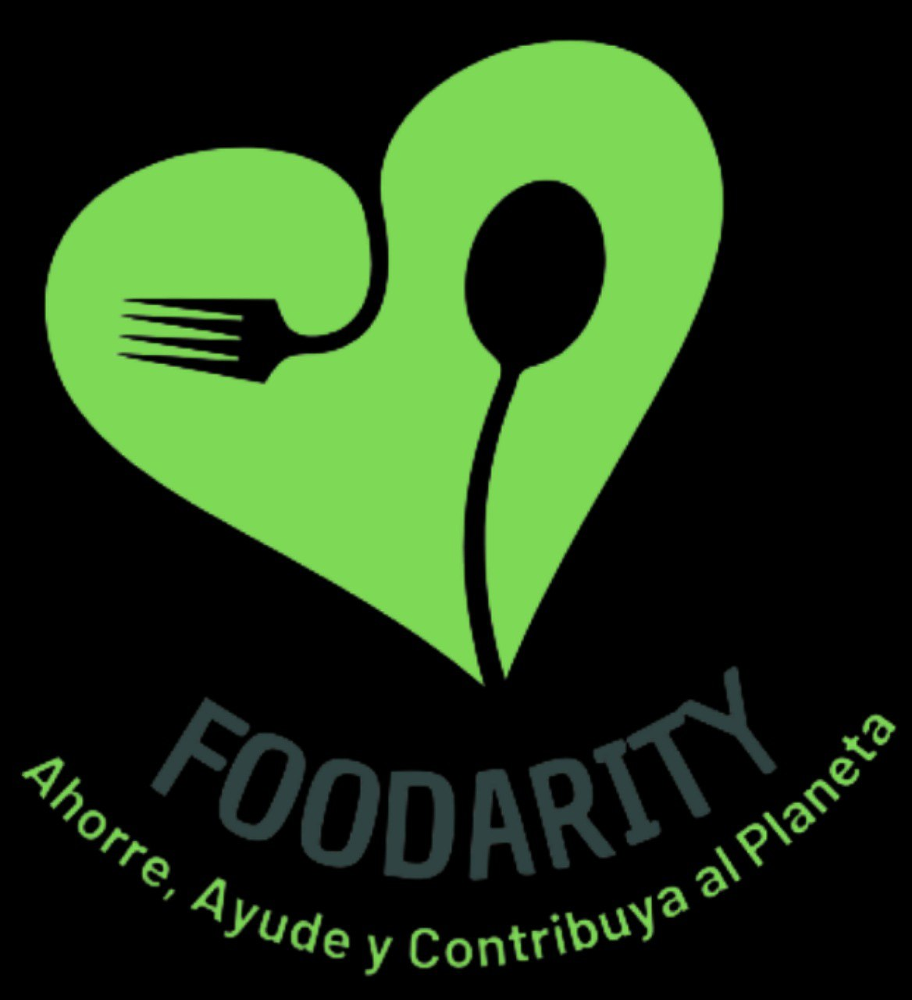
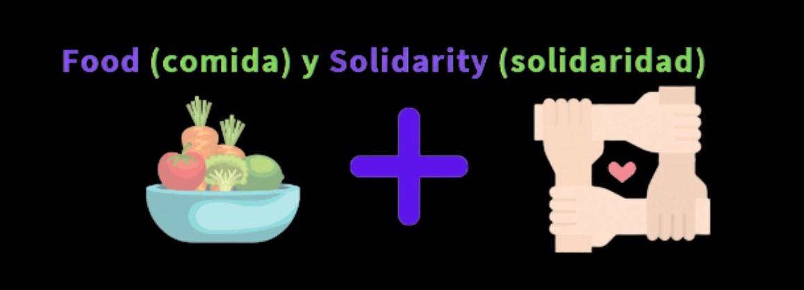

# Welcome to Foodarity !

# Who we are ?

Foodaritty is a MarketPlace that allows companies in the food sector to publish batches of products that are left over from the day and are in very good condition but soon to be out of circulation.
In this way, users can access food at a very low price and in excellent conditions!

 

# Mission

Avoid food loss while contributing to reduce the production of waste and pollution. We help companies to minimize losses while giving people and NGOs the opportunity to purchase food in good condition at excellent prices.

# Vision

Raise awareness of the delicate world food situation and be a source of inspiration to move towards a sustainable future.

# About the project

The Foodarity project was born as the final work of Henry's Bootcamp Career, for the project there was a deadline of three weeks for its delivery. Work was done using agile methodologies (SCRUM), with a one-week sprint and presentations to a product Owner belonging to the Staff.Git Flow was used for version control.

# Visit our page 

https://foodarity.herokuapp.com/

## Stack of Technologies

<h3>Front End</h3>
<ul>
<li>HTML</li>
<li>CSS Modules</li>

<li>JavaScript</li>
<li>React</li>
<li>Redux</li>
<li>Material UI</li>
</ul>

<h3>Back End</h3>

<ul>
<li>Node.js</li>
<li>Express</li>
<li>Docker</li>
<li>Sequelize</li>
</ul>

<h3>DataBase</h3>

<ul>

<li>PostgreSQL</li>
</ul>
